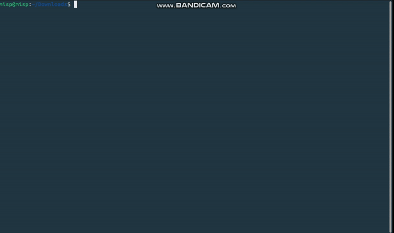

# FinalCTF Security Testing Tool

**Authors:** Shahad, Layan and Dana 
**Course:** Certified Ethical Hacker
**Year:** 2025  

FinalCTF is a lightweight Python-based security testing tool developed for
educational purposes to demonstrate how common web application attacks
can be automated in authorized lab and CTF environments.

The tool is intentionally simple to help students understand how offensive
security tools are structured and executed.

---

## What Does FinalCTF Test?
FinalCTF automates basic checks for the following vulnerabilities:

- SQL Injection
- Reflected Cross-Site Scripting (XSS)
- Access Control Abuse (public admin pages)

---

## Why FinalCTF?
FinalCTF was created to bridge the gap between theoretical web security concepts
and hands-on practice. Instead of manually testing each vulnerability, this tool
demonstrates how repetitive security testing tasks can be automated using
simple and readable Python code.

---

## Features
- Simple CLI-based interface
- Lightweight and dependency-minimal
- Works against DVWA, OWASP Juice Shop, and custom lab applications
- Fully open-source and easy to extend
- Designed for learning and experimentation

---

## Installation
```bash
git clone https://github.com/Shahad109/FinalCTF
cd FinalCTF
pip install -r requirements.txt

```

---

## Usage
```bash
python3 FinalCTF.py --sqli http://target/vuln/sqli/?id=
python3 FinalCTF.py --xss http://target/search
python3 FinalCTF.py --admin http://target/#/administration
```

---

## Requirements
- Python 3.8+
- requests library

---

## Demo


---

## Learning Outcomes
By using or extending FinalCTF, students will learn:
- How automated security testing tools are structured
- How SQL injection and XSS payloads are delivered programmatically
- How access control flaws can be identified
- How to build ethical, reproducible security tools

---

## Future Enhancements
- Support POST-based attacks
- Custom payload configuration
- Basic logging and reporting
- Additional vulnerability checks (e.g., CSRF)

---

## Ethical Use Disclaimer
This tool is intended strictly for **educational purposes** and must only be used
in authorized lab or CTF environments. Unauthorized use against real-world
systems is strictly prohibited.

---

## License
This project is licensed under the MIT License.
